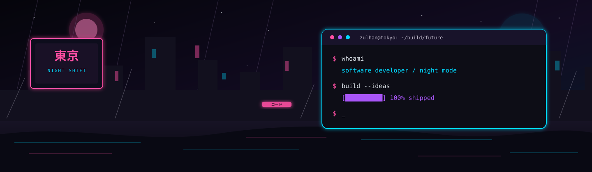

<!--
  TOKYO NIGHT × ANIME × STREET × DEVELOPER
  Visual assets are kept locally in ./Assets for reliable rendering.
-->

  

  <h1>ようこそ 👋</h1>
  <h2>Muhammad Zulhan Fadhil</h2>

  

    <strong>Informatics Student · Software Developer</strong> 
    <code>INDONESIA / TOKYO NIGHT / BUILD MODE: ON</code>
  

  

  

    
    
  

---

## // ABOUT 私

> **コードを書く、未来を作る。** 
> _Write code. Build the future._

I'm **Zulhan**, an Informatics student at Universitas Negeri Surabaya who turns practical ideas into thoughtful web products. I enjoy moving from a rough concept to a usable experience—one commit, one experiment, and one late-night debug session at a time.

- **Focus:** Full-stack web products, intuitive interfaces, and data-driven experiences.
- **Exploring:** AI/ML, backend architecture, and cloud deployment.
- **Building:** Useful applications for real people, from transaction systems to developer tools.
- **Open to:** Open-source collaboration, web projects, and ideas worth shipping.

  

---

## // TECH 技術

  <strong>LANGUAGES</strong>
   
  
    

  <strong>WEB · FRAMEWORKS</strong>
   
  
    

  <strong>DATA · BACKEND</strong>
   
  
    

  <strong>WORKFLOW · DEPLOYMENT</strong>
   
  

---

## // STATS 統計

  
  

  

---

## // ACTIVITY 活動

  

<!-- Generated daily by .github/workflows/snake.yml. -->

  <picture>
    <source media="(prefers-color-scheme: dark)" srcset="https://raw.githubusercontent.com/ZulhanF/ZulhanF/output/github-contribution-grid-snake-dark.svg" />
    
  </picture>

---

## // PROJECTS 作品

### 01 / [bansos.dev](https://bansos.dev)

An open-source Indonesian catalog of legitimate developer promotions, free tiers, cloud credits, and coding-tool discounts. Built to make useful developer resources easier to discover and contribute to.

**Stack:** `SvelteKit` · `Cloudflare Pages` · `Static Site Generation` 
[Repository ↗](https://github.com/ZulhanF/bansos) · [Live site ↗](https://bansos.dev)

### 02 / [KantinKita](https://kantin-app-danish.vercel.app)

A mobile-first canteen point-of-sale system with menu management, checkout, transaction history, and daily sales insights—designed for cashiers on phones and tablets as well as desktop dashboards.

**Stack:** `Next.js` · `Prisma` · `Neon PostgreSQL` 
[Repository ↗](https://github.com/ZulhanF/Kantin-App-Danish) · [Live demo ↗](https://kantin-app-danish.vercel.app)

### 03 / [AEGIS](https://aegis-frontend-lake.vercel.app)

A responsive operations interface that brings together chatbot interactions, ticket management, machine management, monitoring, and collaboration workflows.

**Stack:** `React` · `Vite` · `Tailwind CSS` · `Radix UI` 
[Repository ↗](https://github.com/ZulhanF/AEGIS-Frontend) · [Live demo ↗](https://aegis-frontend-lake.vercel.app)

### 04 / [SiBookan](https://sibookan.my.id)

An online room-booking system for UNESA that helps students and lecturers check availability, manage reservations, and avoid scheduling conflicts.

**Stack:** `PHP` · `MySQL` · `JavaScript` 
[Repository ↗](https://github.com/ZulhanF/SiBookan) · [Live demo ↗](https://sibookan.my.id)

---

## // CONNECT 接続

  
  

---

  

  

    <strong>夢をコードに変える。</strong> 
    Turning dreams into code.
  

  

